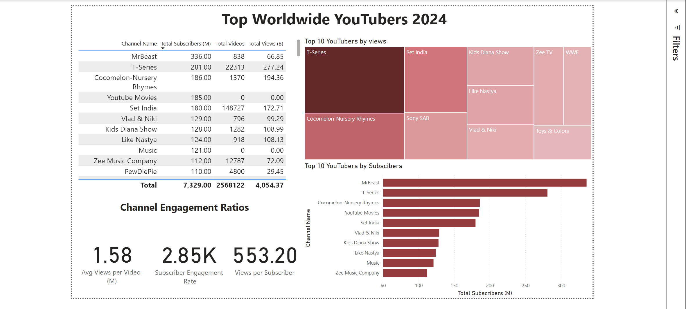

# Data portfolio
------------------------------------
# Top YouTubers for Marketing teams to partner with in 2024 

------------------------------------

# Table of contents
- [Objective](#objective)
  -   [Problems](#problems)
  -   [Target](#target)
- [Data Source](#data-source)
- [Stages](#stages)
  -   [Dashboard](#dashboard)
  -   [Tools](#tools)
- [Development](#development)
  -   [Pseudocode](#pseudocode)
  -   [Data Exploration](#data-exploration)
  -   [Data Cleaning](#data-cleaning)
- [Data Processing](#data-processing)
  -   [Data Processing](#data-processing)
  -   [Create SQL View](#create-sql-view)
- [Testing](#testing)
  -   [Data Quality Tests](#data-quality-tests)
- [Visualization](#visualization)
  -   [Results](#results)
  -   [DAX Measures](#dax-measures)
- [Analysis](#analysis)
  -   [Validation](#validation)
  -   [Discovery](#discovery)
   -  [SQL Query](#sql-query) 
- [Recommendations](#recommendations)
  -   [Potential ROI](#potential-roi)
  -   [Potential Courses of Action](#potential-courses-of-action)
- [Conclusion](#conclusion)


# Objective
To discover the top 100 Youtubers in the world to help the marketing team run successful campaigns

## Problems
- The marketing team has struggled to find the top YouTube channels via a simple search
- There are conflicting data reports and it’s complicated to stay up to date
- Third-party providers are too expensive
- The company’s own BI team doesn’t have the resources to do this request

## Target
- Primary: Head of Marketing
- Secondary: Marketing Team


# Data Source
Data needed to process to YouTubers in 2024, including:

- channel names
- total subscribers
- total views
- total videos uploaded

The data is sourced from Kaggle (an Excel extract) here: https://www.kaggle.com/datasets/taimoor888/top-100-youtube-channels-in-2024

# Stages
- Design
- Development
- Testing
- Analysis


## Dashboard 
What should the dashboard contain based on the requirements provided?
To understand what it should contain, we need to figure out what questions we need the dashboard to answer:

Who are the top 10 YouTubers with the most subscribers?
Which 3 channels have uploaded the most videos?
Which 3 channels have the most views?
Which 3 channels have the highest average views per video?
Which 3 channels have the highest views per subscriber ratio?
Which 3 channels have the highest subscriber engagement rate per video uploaded?
For now, these are some of the questions we need to answer, this may change as we progress down our analysis.

## Tools
| Tool | Purpose |
| ------ | --------- |
| Google Sheeets | Exploring the data |
| SQL Server | Cleaning, testing, and analyzing the data | 
| Power BI | Visualizing the data via interactive dashboards |
| GitHub	| Hosting the project documentation and version control |

# Development
## Pseudocode
1. Get the data
2. Explore the data in Excel
3. Load the data into SQL Server
4. Clean the data with SQL
5. Test the data with SQL
6. Visualize the data in Power BI
7. Generate the findings based on the insights
8. Write the documentation + commentary
9. Publish the data to GitHub Pages

# Data Exploration
1. There are 4 columns that contain the necessary data for this analysis. There is no need to contact the client for additional data.
2. The first column contains the channel name.
3. We have more data than we need, so some of these columns would need to be removed

# Data Cleaning

The aim is to refine our dataset to ensure it is structured and ready for analysis.

The cleaned data should meet the following criteria and constraints:

- Only relevant columns should be retained.
- All data types should be appropriate for the contents of each column.
- No column should contain null values, indicating complete data for all records.

| Property | Description |
| ------ | --------- |
| Number of rows | 100 |
| Number of columns | 4 | 

Below is the table of the expected schema for the clean data:

| Column Name	 | Data Type | Nullable |
| ------ | --------- | ------------- |
| Username | text | No |
| Subscribers | int | No |
| Uploads | int | No |
| Views | bigint | No |


Steps needed to clean and shape data:
- Remove unnecessary columns by only selecting the ones you need
- Convert text data into numeric where necessary

# Data Processing


```sql

CREATE DATABASE youtube_db CHARACTER SET utf8mb4 COLLATE utf8mb4_unicode_ci;

USE youtube_db;


-- Check data
SELECT * FROM youtube_top100;

/*
Data cleaning steps
 1. Remove unnecessary columns
 2. Extract the username from the name column
 3. Rename the column names
*/

SELECT
	Username,
    Subscribers,
    Uploads,
    Views
FROM
	youtube_top100;	
    
    
-- subscriber count needs to be updated to numeric values
UPDATE youtube_top100
SET Subscribers = CASE
    WHEN Subscribers LIKE '%m' THEN CAST(SUBSTRING(Subscribers, 1, LENGTH(Subscribers) - 1) AS DECIMAL) * 1000000
    ELSE CAST(Subscribers AS DECIMAL)  -- If no 'm', keep the value as is
END;

-- test data
SELECT * FROM youtube_top100;

-- need to fix uploads and views to be able to change them to int and bigint for views
UPDATE youtube_top100
SET 
    Uploads = CAST(REPLACE(REPLACE(Uploads, ',', ''), ' ', '') AS UNSIGNED),
    Views = CAST(REPLACE(REPLACE(Views, ',', ''), ' ', '') AS UNSIGNED);

UPDATE youtube_top100
SET Uploads = TRIM(Uploads), Views = TRIM(Views);

 -- test data
SELECT
	Username,
    Subscribers,
    Uploads,
    Views
FROM 
	youtube_top100;
```

# Create SQL view

```sql
-- create view to make it easy to access without filtering data
CREATE VIEW view_youtube_top100 AS
SELECT
	Username,
    Subscribers,
    Uploads,
    Views
FROM 
	youtube_top100;

```


# Testing
## Data quality tests

```sql
/*
Data quality test
1. Check if there are 100 records (row count) --- passed
2. Check if there are 4 columns (column count) --- passed
3. Username must be string, other columns must be numeric (data type check) --- passed
4. Each record must be unique (duplicate count check) --- passed

Expectations
Row count = 100
Column count =. 4

Data types
Username = VARCHAR
Subscribers = INT
Uploads = INT
Views = BIGINT

Duplicates = 0 
*/

-- 1. Row count check
SELECT 
	COUNT(*) AS num_of_rows
FROM 
	view_youtube_top100;

-- 2. Column count check
SELECT 
	COUNT(*) AS column_count
FROM 
	INFORMATION_SCHEMA.COLUMNS
WHERE 
	TABLE_NAME = 'view_youtube_top100';


-- 3. Data type check
SELECT 
	COLUMN_NAME,
    DATA_TYPE
FROM 
	INFORMATION_SCHEMA.COLUMNS
WHERE 
	TABLE_NAME = 'view_youtube_top100';


-- 4. Duplicate check
SELECT
	Username,
    COUNT(*) AS duplicate_count
FROM 
	view_youtube_top100
GROUP BY 
	Username
HAVING
	COUNT(*) > 1;


-- check data
SELECT *
FROM view_youtube_top100
ORDER BY Subscribers DESC;
```


# Visualization
## Results


# DAX Measures
## 1. Total Subscribers
```dax
Total Subscribers (M) = 
VAR million = 1000000
VAR sumOfSubscribers = SUM(Project1_Top_100_Youtubers[Subscribers])
VAR totalSubscribers = DIVIDE(sumOfSubscribers, million)

RETURN totalSubscribers
```

## 2. Total Views (B)
```dax
Total Views (B) = 
VAR billion = 1000000000
VAR sumOfTotalViews = SUM(Project1_Top_100_Youtubers[Views])
VAR totalViews = DIVIDE(sumOfTotalViews, billion)

Return totalViews
```

## 3. Total Videos
```dax
Total Videos = 
VAR totalVideos = SUM(Project1_Top_100_Youtubers[Uploads])

RETURN totalVideos
```

## 4. Average Views Per Video (M)
```dax
Avg Views per Video (M) = 
VAR sumOfTotalViews = SUM(Project1_Top_100_Youtubers[Views])
VAR sumOfTotalVideos = SUM(Project1_Top_100_Youtubers[Uploads])
VAR avgViewsPerVideo = DIVIDE(sumOfTotalViews, sumOfTotalVideos, BLANK())
VAR finalAvgViewsPerVideo = DIVIDE(avgViewsPerVideo, 1000000, BLANK())

RETURN finalAvgViewsPerVideo
```

## 5. Subscriber Engagement Rate
```dax
Subscriber Engagement Rate = 
VAR sumOfTotalSubscribers = SUM(Project1_Top_100_Youtubers[Subscribers])
VAR sumOfTotalVideos = SUM(Project1_Top_100_Youtubers[Uploads])
VAR subscriberEngagementRate = DIVIDE(sumOfTotalSubscribers, sumOfTotalVideos, BLANK())

RETURN subscriberEngagementRate 
```

## 6. Views per subscriber
```dax
Views per Subscriber = 
VAR sumOfTotalViews = SUM(Project1_Top_100_Youtubers[Views])
VAR sumOfTotalSubscribers = SUM(Project1_Top_100_Youtubers[Subscribers])
VAR viewsPerSubscriber = DIVIDE(sumOfTotalViews, sumOfTotalSubscribers, BLANK())

RETURN viewsPerSubscriber
```

# Analysis

We need to answer these key questions for the Head of Marketing:

1. Who are the top 10 YouTubers with the most subscribers?
2. Which 3 channels have uploaded the most videos?
3. Which 3 channels have the most views?
4. Which 3 channels have the highest average views per video?
5. Which 3 channels have the highest views per subscriber ratio?
6. Which 3 channels have the highest subscriber engagement rate per video uploaded?


## 1. Who are the top 10 YouTubers by subscriber count?
| Rank | Username | Subscribers (M) |
| ------ | --------- | ------------- |
| 1 | MrBeast | 336 |
| 2 | T-Series | 281 |
| 3 | Cocomelon-Nursery Rhymes | 186 |
| 4 | YouTube Movies | 185 |
| 5 | Set India | 180 |
| 6 | Vlad & Niki | 129 |
| 7 | Kids Diana Show | 128 |
| 8 | Like Nastya | 124 |
| 9 | Music | 121 |
| 10 | Zee Music Company | 112 |

## 2. Which 3 channels have uploaded the most videos?
| Rank | Username | Video count |
| ------ | --------- | ------------- |
| 1 | ABP NEWS | 433181 |
| 2 | Aaj Tak | 415087 |
| 3 | ABS-CBN Entertainment | 234889 |

## 3. Which 3 channels have the most views?
| Rank | Username | Views (B) |
| ------ | --------- | ------------- |
| 1 | T-Series | 277.24 |
| 2 | Cocomelon-Nursery Rhymes | 194.36 |
| 3 | Set India | 172.71 |

## 4. Which 3 channels have the highest average views per video?
| Rank | Username | Avg Views Per Video (M) |
| ------ | --------- | ------------- |
| 1 | BadBunny | 236.93 |
| 2 | EminemMusic | 164.57 |
| 3 | KatyPerry | 162.45 |


## 5. Which 3 channels have the highest views per subscriber ratio?
| Rank | Username | Avg Views Per Video (M) |
| ------ | --------- | ------------- |
| 1 | Sony SAB | 1256.87 |
| 2 | Toys & Colors | 1211.64 |
| 3 | Zee TV | 1134.50 |

## 6. Which 3 channels have the highest subscriber engagement rate per video uploaded?
| Rank | Username | Avg Views Per Video (M) |
| ------ | --------- | ------------- |
| 1 | UR.Cristiano | 900,000.00 |
| 2 | MrBeast | 400,954.65 |
| 3 | MrBeast2 | 382,113.82 |

### Notes
In this case, we are going to focus on the metrics that are most important in generating ROI. We fill focus on channels with the highest:

- subscribers
- total views
- videos uploaded


# Validation
Calculation breakdown
Campaign idea = product placement

1. MrBeast

Average views per video = 79.8 million
Product cost = $5
Potential units sold per video = 79.8 million x 2% conversion rate = 1,595,600 units sold
Potential revenue per video = 1,595,600 x $5 = $7,978,000
Campaign cost (one-time fee) = $50,000
Net profit = $7,978,000 - $50,000 = $$7,878,000

2. T-Series

Average views per video = 12.4 million
Product cost = $5
Potential units sold per video = 12.4 million x 2% conversion rate = 248,600 units sold
Potential revenue per video = 248,600 x $5 = $1,243,000
Campaign cost (one-time fee) = $50,000
Net profit = $1,243,000 - $50,000 = $1,143,000

3. Cocomelon-Nursery Rhymes

Average views per video = 141.9 million
Product cost = $5
Potential units sold per video = 141.9 million x 2% conversion rate = 2,837,400 units sold
Potential revenue per video = 2,837,400 x $5 = $14,187,000
Campaign cost (one-time fee) = $50,000
Net profit = $14,187,000 - $50,000 = $14,087,000

Best option from category: Cocomelon-Nursery Rhymes

# SQL Query

```sql
/*
1. Define the variable
2. Create a CTE (common table expression) that rounds the avg views per video
3. Select the columns that are requiredfor the analysis
4. Filter the results by the YouTube channels with the highest subsciber bases
5. Order by net_profit (DESC)
*/


-- 1.
SET @coversionRate = 0.02;		 -- the conversion rate at 2%
SET @productCost = 5.0;  		 -- the product cost at $5
SET @campaignCost = 100000.0;	 -- the campaign cost at $50,000


-- 2. 
WITH ChannelData AS (
	SELECT
    Username,
    Views,
    Uploads,
    ROUND((Views / Uploads), -4) AS rounded_avg_views_per_video
FROM 
	view_youtube_top100

)


-- 3, 4, 5

SELECT
	Username,
    rounded_avg_views_per_video,
    ROUND((rounded_avg_views_per_video * @coversionRate), 2) AS potential_units_sold_per_video,
    ROUND((rounded_avg_views_per_video * @coversionRate * @productCost), 2) AS potential_revenue_per_video,
    ROUND(((rounded_avg_views_per_video * @coversionRate * @productCost) - @campaignCost), 2) AS net_profit
FROM 
	ChannelData
WHERE 
	Username IN ('MrBeast', 'T-Series', 'Cocomelon-Nursery Rhymes')
ORDER BY
	net_profit DESC;
```

# Discovery
We discovered the following:

1. MrBeast, T-Series, Cocomelon-Nursery Rhymes are the channnels with the most subscribers
2. ABP NEWS, Aaj Tak, ABS-CBN Entertainment are the channels with the most videos uploaded
3. T-Series, Cocomelon-Nursery Rhymes, Set India are the channels with the most views
4. Entertainment channels are useful for broader reach, as the channels posting consistently on their platforms and generating the most engagement are focus on entertainment and music

# Potential ROI
What ROI do we expect if we take this course of action?
Setting up a collaboration deal with Cocomelon-Nursery Rhymes would make the client a net profit of $14,087,000 per video


# Action plan
What course of action should we take and why?
Based on our analysis, I recommend Cocomelon-Nursery Rhymes as the best channel to advance a long-term partnership deal with to promote the client's products.

What steps are recommended for an effective decision?
1. Reach out to Cocomelon-Nursery Rhymes for a partnership
2. Negotiate contracts within the budgets allocated to each marketing campaign
3. Kick off the campaign and track the KPI
4. Review the campaign stats, gather insights and optimize based on feedback from the marketing team


